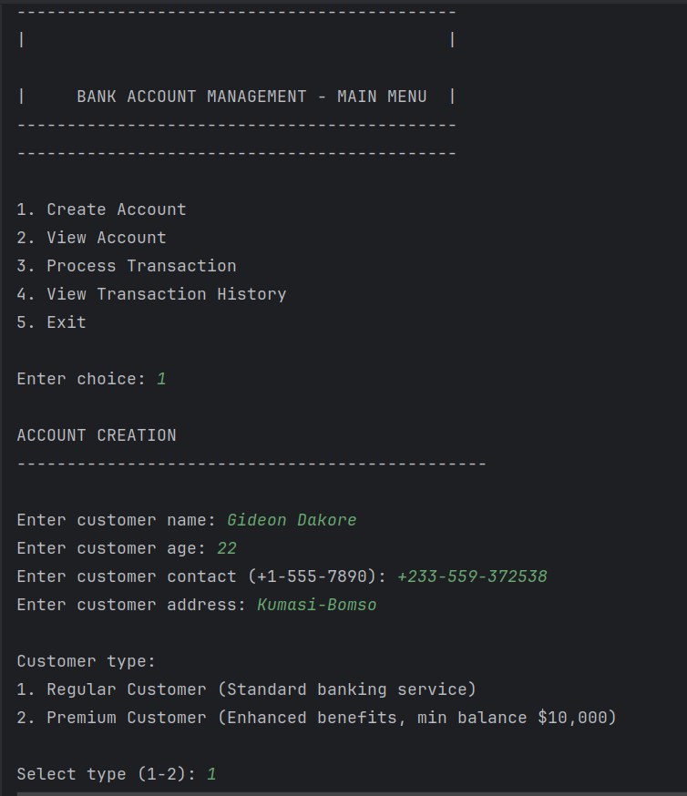
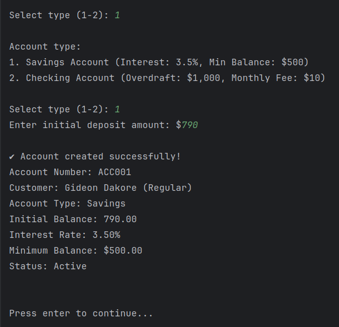
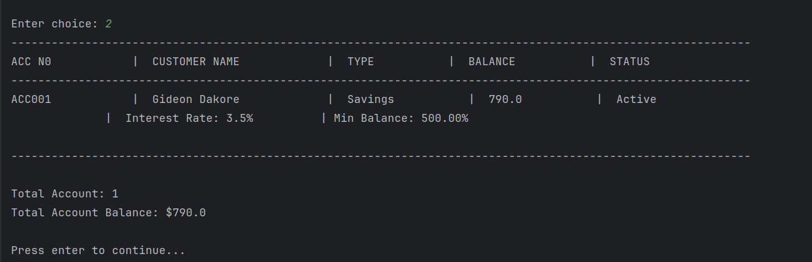
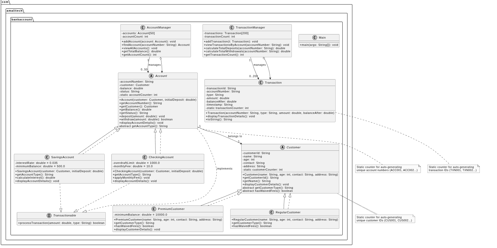

# Bank Account Management System

A **console-based Java application** built using **Object-Oriented Programming (OOP)** principles and **Maven**.  
The system allows users to manage basic banking operations such as creating accounts, depositing money, withdrawing funds, and viewing account information. This project was developed as part of an academic assignment following structured requirements for OOP design and console interaction.

---

## 📌 Features

- Create new bank accounts
- Deposit funds into an account
- Withdraw funds with balance validation
- Display account details
- Display all created accounts
- Automatically generate account IDs
- Input validation and error handling
- Clean separation of logic using OOP principles

---

## 🛠️ Technologies Used

- **Java (JDK 17 or later)**
- **Maven** (Project build + dependency management)
- **Java Collections (ArrayList, etc.)**
- **Scanner (Console Input/Output)**
- **SonarQube - for automated code quality and security analysis**

---

## 📂 Project Structure

BankAccount/

├── src/

│ └── main/

│ └── java/

│ └── com.amalitech.bankaccount/

│ ├── account/ # Classes representing account types and data structures

│ ├── customer/ # Classes representing customers types and data structures

│ ├── enums/ # Enums for serving as a helpers for data types

│ ├── helpers/ # Helper utilities (validation, formatting, etc.)

│ ├── interfaces/ # Interface class for implementing abstraction

│ ├── menu/ # Printable methods for displaying various functionality

│ ├── records/ # Records for collecting and transferring data among classes

│ ├── transaction/ # Transaction classes

│ └── Main.java # Application entry point with console menu

├── pom.xml # Maven configuration file

└── README.md # Project documentation

## 🚀 Getting Started

### **1. Prerequisites**

Before running the program, ensure you have:

- Java **17+**
- Maven **4.0+**
- Git installed

---

### **2. Clone the Repository**

```bash
git clone https://github.com/gideondakore/BankAccount.git
cd BankAccount


mvn clean install

OR

mvn compile
java -cp target/classes Main
```
## 📘 How the System Works
When the application starts, you will see a menu such as:

--------------------------------------------
    --------------------------------------------
    |                                          |
    
    |     BANK ACCOUNT MANAGEMENT - MAIN MENU  |                                 |
    --------------------------------------------
    --------------------------------------------
    
    1. Create Account
    2. View Account
    3. Process Transaction
    4. View Transaction History
    5. Exit
    """;


Each option executes a corresponding service method, such as:

handleCreateAccount()
viewAllAccounts()
processTransaction()
viewTransactionHistory()

The system stores all account data temporarily in memory using Java collections.

## 👤 Author

Gideon Dakore
GitHub: https://github.com/gideondakore

## 📸 Screen Shots







## 📐 Project UML Diagram
